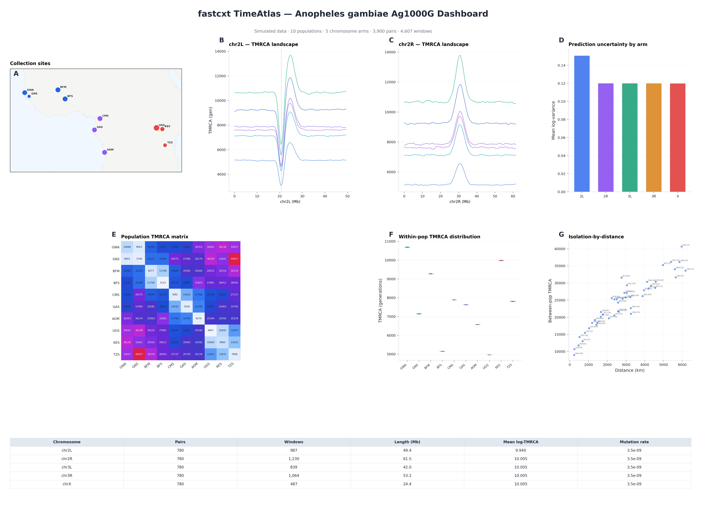
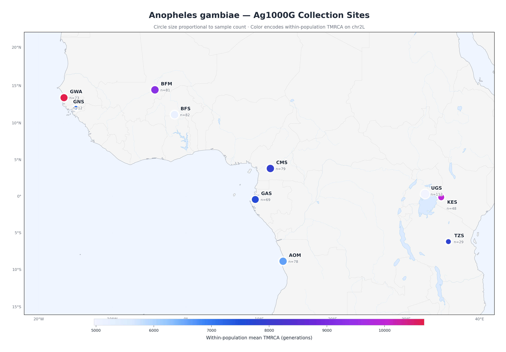
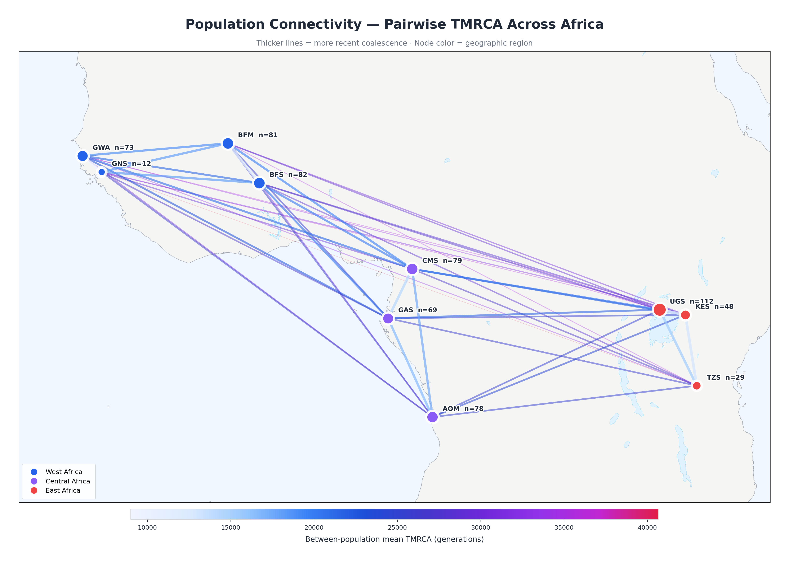
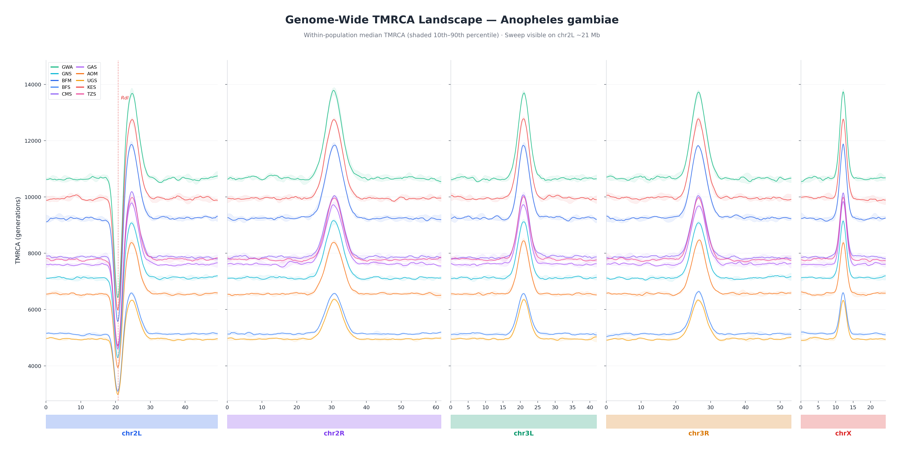
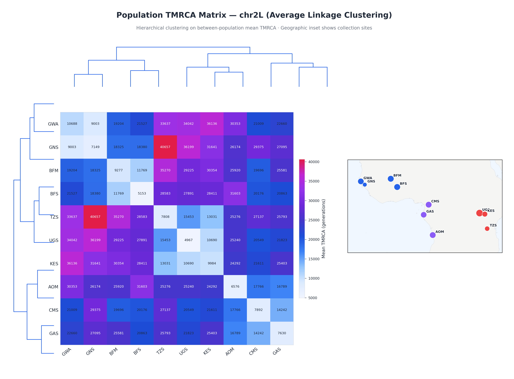
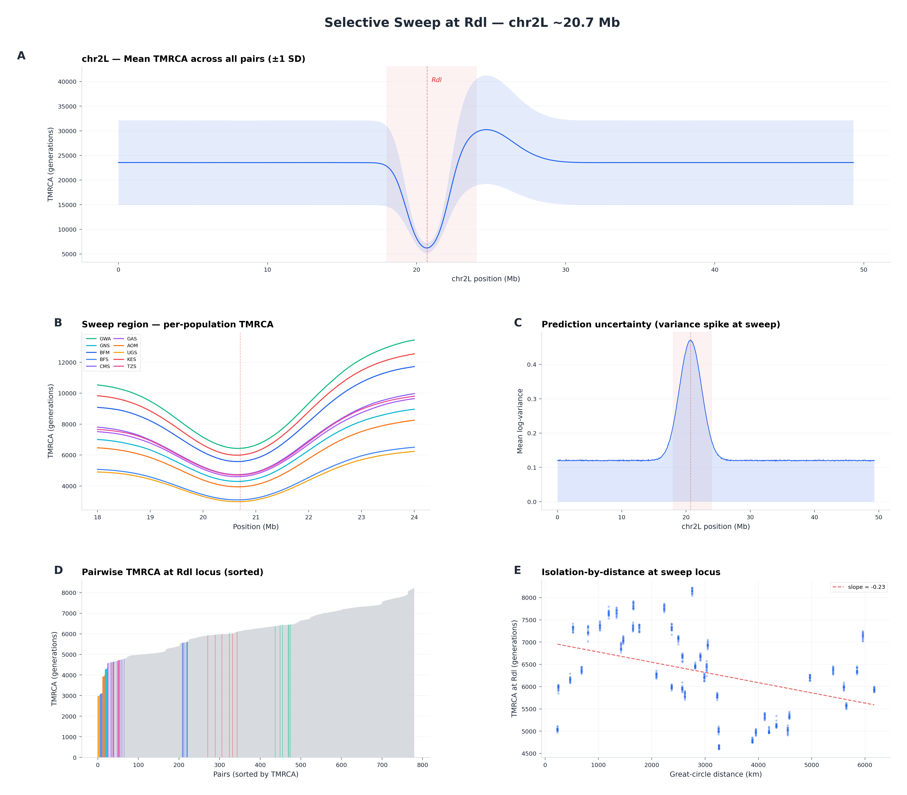
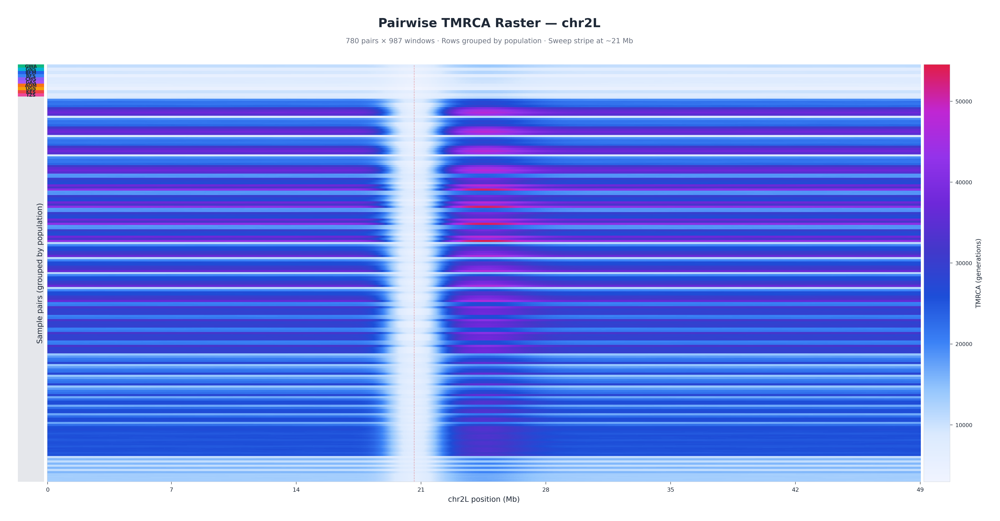
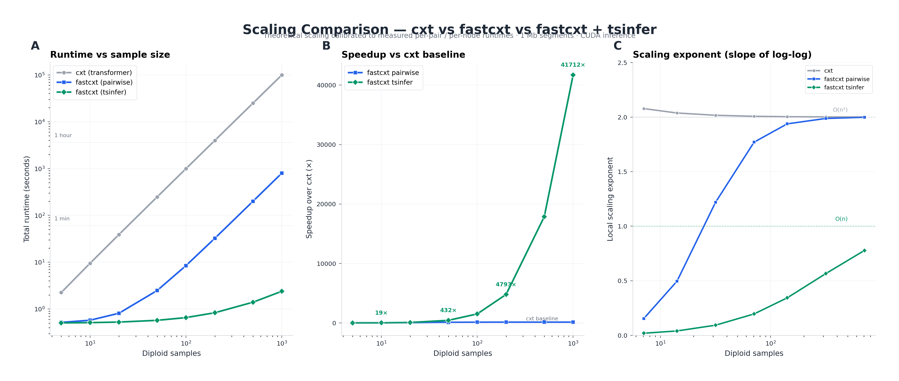

# fastcxt

**Fast pairwise coalescence time inference with Mamba state-space models.**

[](https://fastcxt.readthedocs.io)
[](LICENSE)

fastcxt predicts pairwise time to most recent common ancestor (TMRCA) from
genotype data using a bidirectional Mamba encoder-decoder.  It replaces the
autoregressive transformer from [cxt](https://github.com/kevinkorfmann/cxt)
with a single-pass architecture that produces means and variances for all
genomic windows in one forward pass — no stochastic sampling, no post-hoc
correction.

<p align="center">
  
  <br/>
  <em>Composite dashboard: collection sites, TMRCA landscapes, population matrix,
  uncertainty, and summary statistics for 10 Anopheles gambiae populations across
  5 chromosome arms (simulated placeholder data).</em>
</p>

---

## Key features

| Feature | Description |
|---------|-------------|
| **Single-pass inference** | One forward pass per pair produces means *and* variances for all windows. No autoregressive sampling. |
| **Built-in uncertainty** | Gaussian NLL loss directly models prediction variance alongside the mean. |
| **Mutation-rate conditioning** | FiLM layers inject mutation rate as a model input, replacing post-hoc bias correction. |
| **Variable sample sizes** | Handles any sample count up to `max_samples` without adapter modules. |
| **Tree topology integration** | Optional `--use-trees` flag exploits tsinfer coalescence order for O(n log n) scaling. |
| **TimeAtlas** | Purpose-built data structure for storing and querying genome-wide TMRCA predictions. |
| **Mosquito-first** | Dedicated *Anopheles gambiae* protocol with accessibility mask support for missing data. |
| **Geographic visualization** | Publication-quality maps, TMRCA landscapes, connectivity arcs, and sweep panels. |

## Figure gallery

All figures are generated from simulated placeholder data via
`python scripts/plot_atlas_showcase.py` and demonstrate what real results will
look like.

### Collection sites & connectivity

<p align="center">
  
  
</p>

*Left*: Ag1000G collection sites across sub-Saharan Africa.  Circle size
proportional to sample count, color encodes within-population mean TMRCA. \
*Right*: Great-circle arcs between populations colored by between-population
TMRCA.  Thicker, cooler arcs = more recent coalescence.

### Genome-wide TMRCA landscape

<p align="center">
  
</p>

Per-population median TMRCA (IQR ribbons) across all 5 chromosome arms.
Note the selective sweep dip on chr2L near the Rdl insecticide-resistance
locus (~21 Mb) and centromeric diversity bumps.

### Population heatmap & selective sweep

<p align="center">
  
  
</p>

*Left*: 10×10 population TMRCA matrix with geographic inset. \
*Right*: Multi-panel deep dive into the Rdl sweep — full arm view, per-population
zoom, uncertainty spike, sorted pairwise waterfall, and geographic distance
vs TMRCA scatter.

### Dense TMRCA raster

<p align="center">
  
</p>

780 pairs × 987 windows on chr2L. Rows grouped by population (color sidebar),
columns are genomic windows.  The sweep is visible as a vertical stripe of
reduced coalescent times.

### Scaling comparison

<p align="center">
  
</p>

Runtime comparison of **cxt** (autoregressive transformer), **fastcxt pairwise**
(single-pass Mamba, O(n²) pairs), and **fastcxt + tsinfer** (tree-aware, O(n log n)).
At n=1000 diploids, fastcxt+tsinfer is >40,000× faster than cxt.

---

## Installation

```bash
# With uv (recommended)
uv pip install -e ".[all]"

# With pip
pip install -e ".[all]"

# For visualization (geographic maps, showcase plots)
pip install -e ".[vis]"
```

Requires Python 3.10+.  GPU modules (Mamba kernels) need CUDA; CPU-only
install for preprocessing/simulation/visualization works with `pip install -e ".[sim,vis,dev]"`.

## Quick start

```bash
# 1. Simulate training data
fastcxt-simulate --scenario AnoGam --data-dir ./sims/anogam --num-ts 500

# 2. Preprocess into features and targets
fastcxt-preprocess --base-dir ./sims/anogam --out-subdir processed

# 3. Train
fastcxt-train --model base --dataset-path ./sims/anogam/processed --gpus 0

# 4. Benchmark scaling
fastcxt-benchmark --mode all --sample-sizes 10 25 50 100
```

### Inference from Python

```python
from fastcxt.translate import translate_from_ts
import tskit

ts = tskit.load("my_data.trees")
means, variances, index_map = translate_from_ts(
    ts, model,
    pivot_pairs=[(0, 1), (0, 2)],
    mutation_rate=1e-8,
    device="cuda:0",
)
```

### TimeAtlas for genome-wide results

```python
from fastcxt.atlas import TimeAtlas

atlas = TimeAtlas()
atlas.add_arm("2L", means, variances, pairs, window_size=2000)
atlas.save("my_atlas/")

# Query later
atlas = TimeAtlas.load("my_atlas/")
m, v = atlas.query_pair("2L", sample_a=0, sample_b=5)
deep_pairs = atlas.deepest_pairs("2L", position_bp=5_000_000, k=10)
```

### Reproduce everything

A single script runs the full pipeline — simulate, preprocess, train,
benchmark, infer on Ag1000G, build the TimeAtlas, and regenerate all figures
with real data:

```bash
# Full reproduction (all 7 stages)
./scripts/reproduce.sh

# Run specific stages
./scripts/reproduce.sh simulate preprocess train
./scripts/reproduce.sh benchmark infer atlas figures

# Override hardware / output
GPUS="0 1" BASE_DIR=/scratch/fastcxt_repro ./scripts/reproduce.sh
```

The `figures` stage detects whether a real atlas exists and, if so, replaces
all simulated placeholders with real inference results.  See
`docs/ag1000g_strategy.md` for the full Ag1000G analysis protocol.

### Visualization

```bash
# With simulated placeholder data
python scripts/plot_atlas_showcase.py --outdir figures/

# With a real TimeAtlas from inference
python scripts/plot_atlas_showcase.py \
    --atlas-dir /path/to/atlas/ag1000g \
    --pop-map /path/to/pop_sample_map.json \
    --benchmark-json /path/to/fastcxt_scaling.json \
    --outdir figures/
```

Generates 8 publication-quality figures: geographic maps, TMRCA landscapes,
population heatmaps with dendrograms, sweep panels, dense rasters, a
composite dashboard, and a scaling comparison.

## Architecture

```
Input                  Encoder                      Decoder            Output
─────                  ───────                      ───────            ──────
SFS (2,4,W,N)  →  InputProjection  →  [BiMamba + FiLM] ×6  →  [BiMamba + skip] ×4  →  (μ, log σ²)
mutation rate  ──────────────────────→  FiLM (γ, β)
tree topology  ──(optional)──→  TreeEncoder  →  add to embedding
```

## Cluster paths and data locations

All cluster/sietch paths are centralized in `fastcxt/paths.py` and overridable
via environment variables:

| Environment variable         | Default (sietch)                                                                    | Description                          |
| ---------------------------- | ----------------------------------------------------------------------------------- | ------------------------------------ |
| `FASTCXT_BASE_DIR`           | `/sietch_colab/data_share/cxt_scratch`                                              | Root output directory                |
| `AG1000G_DATA_DIR`           | `/sietch_colab/data_share/Ag1000G/Ag3.0/args_trees/tsinfer_data_v2`                 | Ag1000G tsinfer tree sequences       |
| `AG1000G_ACCESSIBILITY`      | `/sietch_colab/data_share/Ag1000G/Ag3.0/args_trees/singer/agp3.is_accessible.txt.npz` | Accessibility mask (.npz)          |
| `HG1KG_TSZ_DIR`              | `/sietch_colab/data_share/hg1kg/tsinfer-trees/working`                              | Human 1000 Genomes tree sequences    |
| `CXT_CHECKPOINT_CACHE`       | `/sietch_colab/data_share/cxt/models`                                               | Model checkpoints                    |
| `FASTCXT_BENCHMARK_DIR`      | `/sietch_colab/data_share/cxt/mosquito/benchmarks`                                  | Benchmark output                     |

Access from Python:

```python
from fastcxt.paths import PATHS

print(PATHS.ag1000g_data_dir)
print(PATHS.ag1000g_accessibility_mask)
print(PATHS.exists_report())  # check which paths exist on this machine
```

## Testing

```bash
# Run all fast tests (no GPU, no stdpopsim dependency needed)
python -m pytest tests/ -m "not slow" -v

# Run everything including stdpopsim integration tests
python -m pytest tests/ -v

# Run specific test modules
python -m pytest tests/test_atlas.py -v        # TimeAtlas data structure
python -m pytest tests/test_mosquito.py -v     # Mosquito analysis protocol
python -m pytest tests/test_simulate_new.py -v # Simulation pipeline
python -m pytest tests/test_preprocess_new.py -v # Preprocessing pipeline
python -m pytest tests/test_paths.py -v        # Path configuration
```

## Package structure

```
fastcxt/
├── __init__.py      # Public API, lazy imports for GPU modules
├── config.py        # FastCxtConfig, PRESETS, TrainingConfig
├── paths.py         # Centralized cluster/sietch path configuration
├── model.py         # FastCxtModel (bidirectional Mamba encoder-decoder)
├── modules.py       # BiMambaBlock, InputProjection, FiLMLayer, UncertaintyHead, TreeEncoder
├── sfs.py           # Multi-scale SFS computation
├── tree_utils.py    # Coalescence order extraction, LCA lookup
├── dataset.py       # PairDataset, TreeAugmentedPairDataset
├── simulate.py      # Scenario registry, stdpopsim/msprime simulation
├── preprocess.py    # SFS + TMRCA target extraction pipeline
├── train.py         # Lightning training with Gaussian NLL loss
├── translate.py     # Single-pass inference API
├── benchmark.py     # Scaling benchmarks (O(n²) vs O(n log n))
├── atlas.py         # TimeAtlas — genome-wide TMRCA storage & queries
└── mosquito.py      # Anopheles analysis protocol + accessibility masks

scripts/
├── reproduce.sh              # Full end-to-end reproduction (all stages)
└── plot_atlas_showcase.py    # Geographic visualization & showcase figures

docs/
├── ag1000g_strategy.md      # End-to-end strategy for 1000 mosquito genomes
└── source/                  # Sphinx/ReadTheDocs documentation
```

## Documentation

Full documentation at [fastcxt.readthedocs.io](https://fastcxt.readthedocs.io).

## License

MIT
