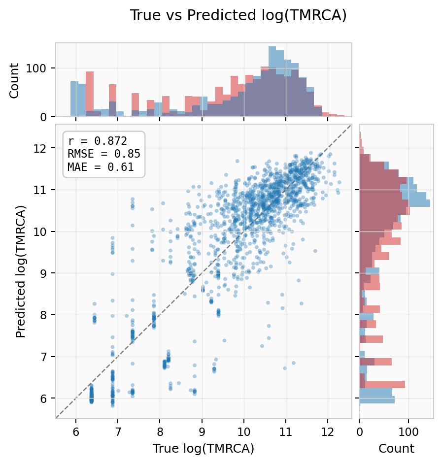
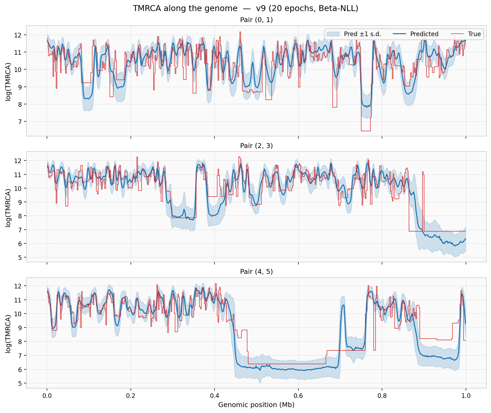
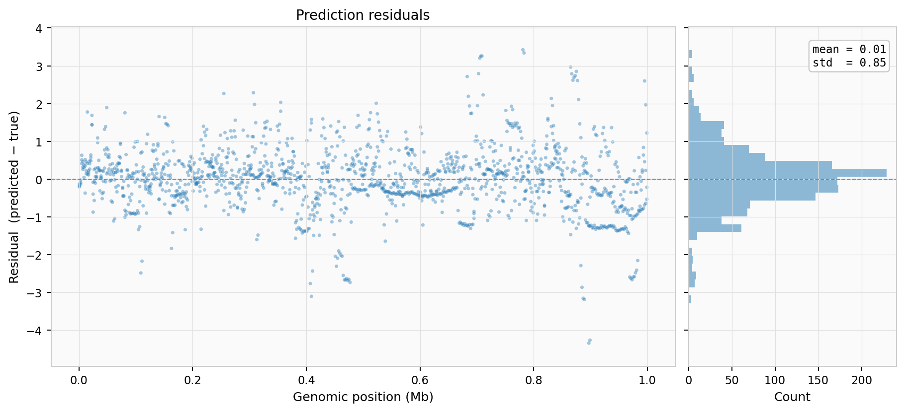

Quickstart
==========

Installation
------------

fastcxt requires Python 3.10+ and a CUDA-capable GPU for the Mamba kernels.

.. tab-set::

   .. tab-item:: uv (recommended)

      .. code-block:: bash

         uv pip install -e ".[all]"

   .. tab-item:: pip

      .. code-block:: bash

         pip install -e ".[all]"

For CPU-only development (e.g. preprocessing, simulation), install without
the GPU dependencies:

.. code-block:: bash

   uv pip install -e ".[sim,docs,dev]"

End-to-end example
------------------

1. **Simulate** training data with variable sample sizes:

.. code-block:: bash

   for N in 10 25 50 100 200; do
       fastcxt-simulate --scenario constant \
           --data-dir ./sims/n${N} --num-ts 200 --n-samples $N
   done

This creates 1000 tree sequences total (200 per sample size) in separate
subdirectories.

2. **Preprocess** into SFS features and TMRCA targets:

.. code-block:: bash

   fastcxt-preprocess --base-dir ./sims --out-subdir processed \
       --extract-trees --max-samples 200

The preprocessor scans ``sims/`` recursively, discovers all ``.trees`` files, and
uses each subdirectory name (``n10``, ``n25``, ...) as the scenario label.  The
``--max-samples 200`` flag pads tree topology features to a consistent dimension
so all sample sizes can be batched together.

3. **Train** a model:

.. code-block:: bash

   fastcxt-train --model base --dataset-path ./sims/processed --gpus 0

4. **Run inference** from Python:

.. code-block:: python

   import fastcxt
   from fastcxt.config import PRESETS
   from fastcxt.model import FastCxtModel

   config = PRESETS["base"]
   model = FastCxtModel(config)
   # model.load_state_dict(torch.load("checkpoint.pt"))

   from fastcxt.translate import translate_from_ts
   import tskit

   ts = tskit.load("my_data.trees")
   means, variances, index_map = translate_from_ts(
       ts, model,
       pivot_pairs=[(0, 1), (0, 2)],
       mutation_rate=1e-8,
       device="cuda:0",
   )

5. **Build a TimeAtlas** for genome-wide results:

.. code-block:: python

   from fastcxt.atlas import TimeAtlas

   atlas = TimeAtlas()
   atlas.add_arm("2L", means, variances, pairs, window_size=2000)
   atlas.save("my_atlas/")

   # Query later
   atlas = TimeAtlas.load("my_atlas/")
   m, v = atlas.query_pair("2L", sample_a=0, sample_b=5)

6. **Visualize** with geographic context:

.. code-block:: bash

   # Generate showcase figures with simulated placeholder data
   python scripts/plot_atlas_showcase.py --outdir figures/

This generates publication-quality geographic maps, TMRCA landscapes, population
heatmaps, selective sweep panels, and a composite dashboard.  See
:doc:`visualization` for the full gallery.

Example results
---------------

The figures below are from a quickstart run: 1000 constant-demography tree
sequences with variable sample sizes (10--200), the ``base`` model preset
trained for 20 epochs with Beta-NLL loss on 3 GPUs.

**True vs Predicted log(TMRCA)** — scatter with marginal histograms showing
overall calibration (r = 0.87, RMSE = 0.85):

**TMRCA along the genome** — predicted mean (blue) with ±1 s.d. confidence
band overlaid on the true values (red step) for three sample pairs:

**Residuals** — spatial distribution and histogram of prediction errors:

**Summary** — per-pair Pearson correlation and validation RMSE training curve:

.. image:: _static/figures/04_summary.png
   :width: 100%
   :alt: Per-pair correlation and training curve
