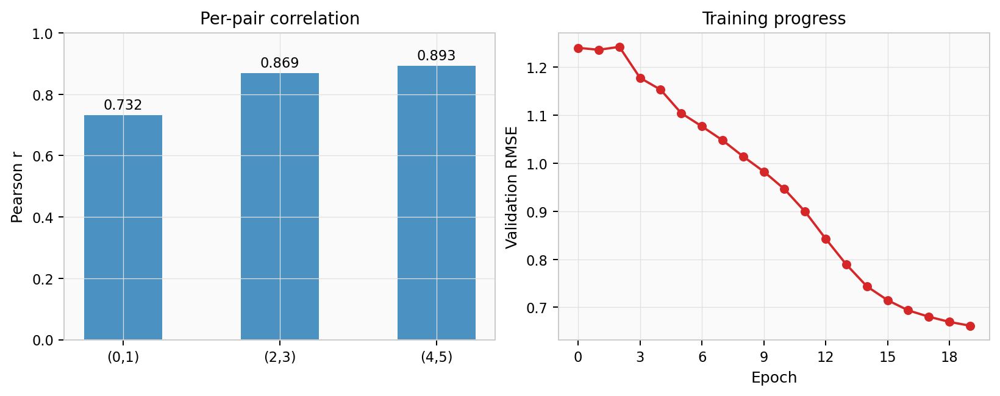

Training
========

fastcxt uses PyTorch Lightning for distributed training with Beta-NLL loss.

Quick start
-----------

.. code-block:: bash

   # Train base model on preprocessed data
   fastcxt-train --model base --dataset-path ./sims/processed --gpus 0

   # Multi-GPU training
   fastcxt-train --model large --dataset-path ./sims/processed --gpus 0 1 2 3

   # With tree features
   fastcxt-train --model base_trees --dataset-path ./sims/processed --gpus 0

Model presets
-------------

==============  ========  ===========  ===========  ======
Preset          d_model   enc_layers   dec_layers   trees
==============  ========  ===========  ===========  ======
``small``       128       4            2            no
``base``        256       6            4            no
``large``       512       8            6            no
``base_trees``  256       6            4            yes
==============  ========  ===========  ===========  ======

Training configuration
----------------------

The ``TrainingConfig`` dataclass controls optimizer and scheduler settings:

.. code-block:: python

   from fastcxt.config import TrainingConfig

   tc = TrainingConfig(
       max_lr=3e-4,
       min_lr=3e-5,
       warmup_iters=100,
       lr_decay_iters=150_000,
       batch_size=128,
       grad_accum_steps=4,
       weight_decay=0.1,
   )

Loss function
-------------

fastcxt uses **Beta-NLL loss** (β = 0.5), a stabilized variant of Gaussian
negative log-likelihood that prevents variance inflation during early training:

.. math::

   \mathcal{L} = \frac{1}{2}\,\hat\sigma^{2\beta}\!\left(
     \log \hat\sigma^2 + \frac{(y - \hat\mu)^2}{\hat\sigma^2}
   \right)

The key insight is that :math:`\hat\sigma^2` is **detached** inside the
weighting term, so gradient signal for large-error samples is down-weighted
without creating a shortcut for the variance head to simply predict large
variance everywhere.  The log-variance output is clamped to [-10, 10] for
numerical stability.

Validation metrics
------------------

During training, the following metrics are tracked:

- ``train_loss`` / ``val_loss``: Beta-NLL
- ``train_rmse`` / ``val_rmse``: RMSE of the mean prediction
- ``val_coverage_95``: fraction of targets within the 95% prediction interval

The figure below shows a typical training curve for the ``base`` preset
(20 epochs, 3 GPUs, 1000 simulated tree sequences with variable sample sizes):

